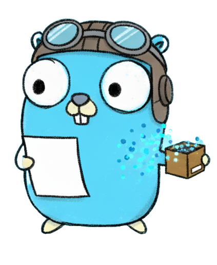

# Jet



[](https://go.dev/)
[](https://github.com/Convict3d/jet/releases)
[](LICENSE)
[](https://goreportcard.com/report/github.com/Convict3d/jet)

A compact, human-readable data serialization format optimized for LLM token efficiency.

## Overview

Jet is a lightweight alternative to JSON/YAML that uses tabular representation to dramatically reduce token count and byte size while maintaining readability. Perfect for LLM applications where token efficiency is critical.

## Key Features

- **Token Efficient**: Up to 70% fewer tokens compared to Indented JSON, and around 36% fewer tokens compared to Single-Line JSON
- **Human Readable**: Clear, tabular format that's easy to understand
- **Two Format Modes**: Normal and Normalized to suit different use cases
- **Type Safe**: Full Go struct support with reflection-based marshaling
- **Zero Dependencies**: Pure Go implementation (tokenizer used only for benchmarks)

## Format Syntax

### Basic Key-Value Pairs
```jet
name: Alice
age: 30
city: Wonderland
```

### Tabular Arrays
```jet
products{category|id|name}:
  Electronics|1|Laptop
  Electronics|2|Mouse
  Literature|3|Book
```

### Nested Objects (Normal Format)
```jet
persons{age|city|name|profile}:
  30|Wonderland|Alice
    > profile:
    email: alice@example.com
    username: alice
```

### Normalized Format
Pipe-delimited nested values with schema in header:
```jet
persons{age|city|name|profile{email|username}}:
  30|Wonderland|Alice
    > profile:
    alice@example.com|alice
```

## Installation

```bash
go get github.com/convict3d/jet
```

## Usage

### Basic Marshaling

```go
package main

import (
    "fmt"
    "github.com/convict3d/jet"
)

type Person struct {
    Name string
    Age  int
    City string
}

func main() {
    data := []Person{
        {Name: "Alice", Age: 30, City: "Wonderland"},
        {Name: "Bob", Age: 25, City: "Builderland"},
    }
    
    // Normal format
    result, _ := jet.Marshal(data)
    fmt.Println(string(result))
}
```

### Format Modes

```go
// Normal format - readable with nested blocks
normal, _ := jet.Marshal(data)

// Normalized format - pipe-delimited nested values
normalized, _ := jet.MarshalNormalized(data)
```

### Struct Tags

Use `jet` tags to customize field names:

```go
type User struct {
    Name     string `jet:"username"`
    Email    string `jet:"email"`
    Internal string `jet:"-"`  // Skip this field
}
```

## Performance Comparison

Real-world benchmark with 100 customers, 5 orders each, 3 items per order:

| Format | Bytes | Tokens | Savings vs JSON | Savings vs JSON Indented |
|--------|-------|--------|-----------------|--------------------------|
| JSON Indented | 400,413 | 112,094 | - | - |
| JSON | 216,312 | 69,394 | - | - |
| Jet Normal | 145,172 | 59,214 | 33% bytes, 15% tokens | 63.7% bytes, 47% tokens |
| Jet Normalized | ~140,000 | ~57,000 | 35% bytes, 18% tokens | 65% bytes, 48% tokens |

## Format Comparison

### Normal Format (192 bytes)
Best for: Readability, debugging, human review
```jet
{age|city|name|profile}:
  30|Wonderland|Alice
    > profile:
    email: alice@example.com
    username: alice
```

### Normalized Format (166 bytes)
Best for: Balance between readability and compression
```jet
{age|city|name|profile{email|username}}:
  30|Wonderland|Alice
    > profile:
    alice@example.com|alice
```

## Use Cases

- **LLM Tool Responses**: Minimize token usage in function calling
- **Multi-Agent Systems**: Efficient data exchange between agents
- **API Responses**: Compact data transfer
- **Configuration Files**: Human-readable with minimal footprint
- **Data Pipelines**: Efficient serialization for data processing

## Syntax Rules

1. **Indentation**: 2 spaces for nesting levels
2. **Tabular Headers**: `{field1|field2}:` with pipe separators
3. **Nested Blocks**: `> field:` sigil for nested objects
4. **Schema Declaration**: Normalized uses pipes: `profile{email|username}`
5. **Field Naming**: Auto-lowercase struct field names (customizable with tags)

## Limitations

- **Unmarshaling**: Not yet implemented (roadmap item)
- **Non-Tabular Arrays**: Limited support for heterogeneous arrays

## Roadmap

- [ ] Unmarshal implementation
- [ ] Streaming support
- [ ] Custom encoders/decoders

## Contributing

Contributions welcome! Please open an issue or PR for:
- Bug fixes
- Feature requests
- Documentation improvements
- Performance optimizations

## License

MIT License - see LICENSE file for details

## Benchmarks

Run benchmarks:
```bash
go test -v -run TestTokenComparison
```

Token counting uses GPT-4's cl100k_base encoding via tiktoken.

## Examples

See the `*_test.go` files for comprehensive examples:
- `marshal_test.go` - Normal format examples
- `marshal_normalized_test.go` - Normalized format examples
- `benchmarks_test.go` - Performance comparisons

> **Note**: Test cases were generated with AI assistance to ensure comprehensive coverage.

## Why Jet?

Traditional formats like JSON are verbose and token-inefficient for LLM applications. Jet provides:

1. **Token Efficiency**: Critical for staying within context windows
2. **Cost Savings**: Fewer tokens = lower API costs
3. **Speed**: Faster processing with less data
4. **Readability**: Still human-readable unlike binary formats

Perfect for building efficient multi-agent systems and LLM-powered applications!
